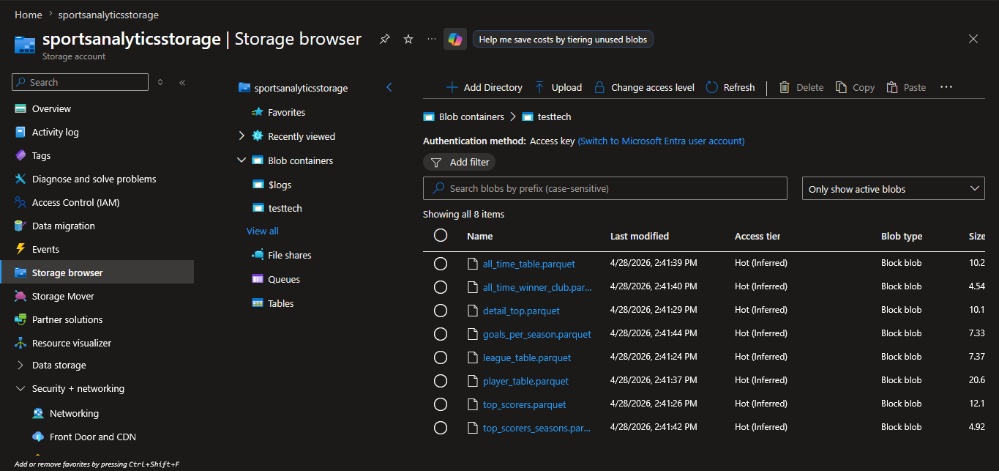
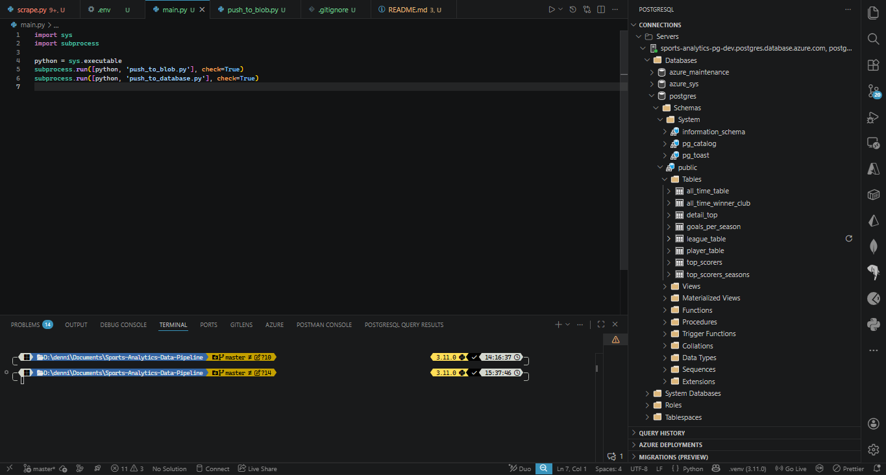
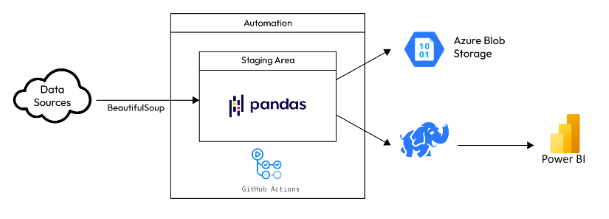
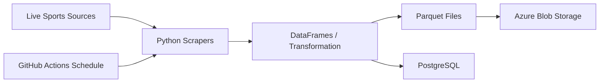

# Premier League Data Engineering Project

An end-to-end data engineering project that automates the collection, transformation, storage, and loading of Premier League statistics. The pipeline is designed to be reliable, repeatable, and easy to schedule, making it a strong portfolio piece for demonstrating modern ETL, cloud storage, and database integration skills.

[](https://www.python.org/)
[](https://azure.microsoft.com/en-us/products/storage/blobs/)
[](https://github.com/features/actions)

## Overview

This project builds a repeatable football analytics pipeline that scrapes live Premier League data, transforms it into analysis-ready tables, stores the results in Azure Blob Storage, and loads the same data into PostgreSQL. It is scheduled through GitHub Actions for automated weekend refreshes.

## Highlights

- End-to-end ETL pipeline for Premier League statistics.
- Reliable scraping with schema normalization for Parquet and database loading.
- Azure Blob Storage for durable file-based storage.
- PostgreSQL tables for fast querying and analysis.
- GitHub Actions schedule for weekend refreshes without manual intervention.

## Tech Stack

- Python
- pandas
- BeautifulSoup
- requests
- pyarrow
- Azure Blob Storage
- PostgreSQL
- SQLAlchemy
- GitHub Actions
- python-dotenv

## Pipeline Flow

1. Data extraction from live Premier League and WorldFootball sources.
2. Transformation into structured pandas DataFrames and Parquet files.
3. Loading into Azure Blob Storage and PostgreSQL for downstream analysis.

## Screenshots

These screenshots show the pipeline moving data into cloud storage and PostgreSQL.







## Architecture



## Data Outputs

The pipeline currently produces these datasets:

- `league_table`
- `top_scorers`
- `detail_top`
- `player_table`
- `all_time_table`
- `all_time_winner_club`
- `top_scorers_seasons`
- `goals_per_season`

## Storage Targets

### Azure Blob Storage

The processed datasets are uploaded as `.parquet` files to Azure Blob Storage for durable and low-cost storage.

### PostgreSQL

The same datasets are loaded into PostgreSQL tables for querying, reporting, and further analysis.

## Skills Used

- Python for web scraping, transformation, and orchestration.
- pandas and pyarrow for DataFrame cleaning and Parquet export.
- BeautifulSoup and requests for HTML parsing and data extraction.
- Azure Blob Storage for cloud file storage.
- PostgreSQL and SQLAlchemy for relational data loading.
- GitHub Actions for scheduled automation.
- dotenv for secure local configuration and environment variable management.

## Local Setup

1. Create and activate the virtual environment.
2. Install the dependencies from `requirements.txt`.
3. Set the required environment variables in `.env`.

Example `.env` values:

```env
AZURE_STORAGE_CONNECTION_STRING=<your-storage-connection-string>
CONN_STRING=postgresql://<user>:<password>@<server>.postgres.database.azure.com:5432/<db>?sslmode=require
```

## Running the Pipeline

Run the full pipeline with:

```powershell
\.venv\Scripts\python.exe .\main.py
```

To verify the PostgreSQL load, run:

```powershell
\.venv\Scripts\python.exe .\count_tables.py
```

## GitHub Actions

The repository includes a scheduled workflow at `.github/workflows/scheduled-scrape.yml`.

Workflow behavior:

- Runs every Saturday and Sunday at `00:00 UTC`.
- Supports manual runs through `workflow_dispatch`.
- Checks out the repository, installs dependencies, and runs `main.py`.

Before enabling the workflow, add these repository secrets in GitHub Settings → Secrets and variables → Actions:

- `AZURE_STORAGE_CONNECTION_STRING`
- `CONN_STRING`

## Notes

- Do not commit secrets to source control.
- For production use, store credentials in GitHub Secrets or Azure Key Vault.
- The workflow is configured to support automated weekly runs for the current gameweek.

